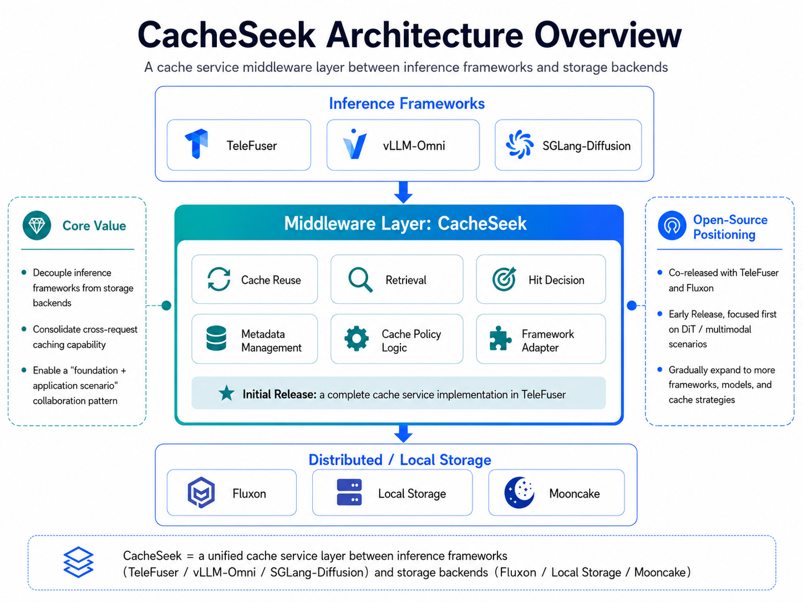

<p align="center">
  <picture>
    <source media="(prefers-color-scheme: dark)" srcset="./docs/assets/cacheseek-logo.png">
    
  </picture>
</p>
<h3 align="center">
面向世界模型的跨请求 KV 缓存中间层 —— 把请求级缓存升级为会话级延续。
</h3>

<p align="center">
  <a href="./LICENSE"></a>
  
  
  
  
</p>

<p align="center">
  中文 | <a href="./README.md">English</a>
</p>

CacheSeek 是推理引擎与分布式存储之间的缓存**中间层**，把跨请求复用从推理循环里抽出来、做成一层可插拔的中间层。它提供**两类复用、覆盖两种模型架构** —— 面向 diffusion 视频的*有损近似复用*，和面向自回归-diffusion 世界模型的*无损精确复用* —— **两端都开放**：向上对接任意推理框架（经可插拔的 `FrameworkAdapter`），向下对接任意分布式 KV/latent 存储（Fluxon、Mooncake、Qdrant、本地……），其中 **[TeleFuser](https://github.com/Tele-AI/TeleFuser)** 与 **Fluxon** 是参考集成，构成*计算—缓存—存储*的闭环。

## 两类复用 (Two reuse families)

### 1 · 精确复用 —— 自回归-diffusion 世界模型 (LingBot)

**无损。** 当新会话的动作前缀与历史逐字节一致时，CacheSeek 直接重放该前缀的 KV（`FastForward`），只重算分叉的尾部 —— 与不中断的连续生成**逐帧 bit-for-bit 一致**。缓存是一片动作链前缀树森林（把 RadixAttention 的 token 前缀换成*动作*前缀）。→ `cacheseek/reuse/exact_prefix`

> 一个会话生成到 chunk 0–4，**暂停并序列化 KV**，随后一个*新请求*从缓存 KV 续写 chunk 5–7 —— 与从不暂停的连续生成逐帧一致。*(LingBot-World，第一人称长城。)*

<table>
<tr>
<td width="50%" align="center"><b>Session A</b> · chunk 0–4 &nbsp;<sub>(正常生成)</sub></td>
<td width="50%" align="center">⏸ 存 KV ▶ &nbsp; <b>Session B</b> · chunk 5–7 &nbsp;<sub>(从缓存续写)</sub></td>
</tr>
<tr>
<td><video src="https://github.com/user-attachments/assets/91b23b48-42ad-40c6-bf40-7812d9649ce6" controls muted loop></video></td>
<td><video src="https://github.com/user-attachments/assets/f4cca44e-055d-4553-adf5-4b0822a77cf3" controls muted loop></video></td>
</tr>
</table>

<details>
<summary><b>▸ 更多断点续写 demo</b> —— 奇幻丛林 · 湖中孤树</summary>
<br>
<table>
<tr>
<td width="50%" align="center"><b>Session A</b> · chunk 0–4</td>
<td width="50%" align="center">⏸ 存 KV ▶ &nbsp; <b>Session B</b> · chunk 5–7 (从缓存)</td>
</tr>
<tr>
<td><video src="https://github.com/user-attachments/assets/fa3fd014-b6b3-4496-a539-6852103036d8" controls muted loop></video></td>
<td><video src="https://github.com/user-attachments/assets/1636140d-b636-445d-83e9-82b271b777b6" controls muted loop></video></td>
</tr>
<tr>
<td><video src="https://github.com/user-attachments/assets/9d87a5a4-c464-4913-9266-5ccc71109c00" controls muted loop></video></td>
<td><video src="https://github.com/user-attachments/assets/e9303e88-f166-44df-a9c7-623a6c16451f" controls muted loop></video></td>
</tr>
</table>
</details>

这条精确路径支撑三类世界模型服务模式：

- **会话级断点续写** —— 请求结束时序列化多层 KV、指针索引、动作 / 相机轨迹与交叉注意力缓存；携带相同 `session_id` 的新请求即可恢复精确断点。
- **交互式分支续写（前缀树）** —— 面对「同初始状态 + 多动作分支」的流量；命中匹配前缀即可跳过共享 chunk 的重复计算。
- **首块预热** —— 对高频初始条件预计算并缓存首块，压平冷启动延迟尖峰。

### 2 · 近似复用 —— diffusion 视频 (Wan2.2)

**有损。** 当新请求与历史*语义相近*时，CacheSeek 载入 donor 的早期去噪 latent 并**跳过前 K 个去噪步**（`SkipStep`）。命中判定 = prompt / 视频 embedding → ANN 检索 → rerank 闸门。Wan2.2-14B 上**端到端时延降低 26–33%**，且可叠加在请求内缓存（cache-dit / DeepCache / TeaCache）与 TeleFuser AdaTaylor 之上。→ `cacheseek/reuse/approximate`

| | | |
|:---:|:---:|:---:|
|  |  |  |
|  |  |  |

| | | |
|:---:|:---:|:---:|
|  |  |  |
|  |  |  |

<p align="center"><em>Wan2.2-14B T2V，2×80GB Hopper。每列上面是冷启动完整去噪的原片，下面是命中缓存的后续请求 —— 复用上面那条作 donor（早期去噪 latent、跳过前 K 步），同场景重渲并带镜头 / 风格变化。具身 / 世界模型场景：街道机器人、医院走廊配送、厨房端盘、桌面抓取、插花、灵巧手转球。</em></p>

两类复用都可持久化到 **Fluxon**（分布式）或本地磁盘；标准化的迁移 + 断点恢复接口让长程会话在实例间路由，而不必绑定单卡。

---

## 关于本次发布

CacheSeek 是位于推理框架与分布式存储之间的**缓存中间层**。它不再把 KV Cache 视为单次请求的临时产物，而是将其重新定义为**可延续的状态快照**——把分散的隐状态与调度索引集中收口到一层抽象之下，提供标准化的**序列化、迁移与断点恢复**接口。它向上对接推理框架（**TeleFuser** 为参考引擎），向下对接分布式存储（默认 **Fluxon**），使复用、检索、命中判定、metadata 与策略逻辑都收口在同一处——上层引擎与下层存储都无需知道跨请求复用是如何决策的。

<p align="center">
  
</p>

### 状态 / 边界

这是一个早期 **alpha** 版本（`0.1.0a1`），依赖前请先读：

- **公共 API 仍在收敛期。** `CacheService`、`CacheConfig` 及 YAML schema 在版本之间可能有破坏性变更，尚无稳定保证。
- **两条参考路径已端到端验证** —— LingBot-World **精确前缀会话续写**（无损，bit-for-bit 验证）与 Wan2.2-14B **近似复用**（端到端时延降低 26–33%）。其他模型 profile 尚未验证。
- **目前只有一个框架 adapter** —— TeleFuser，接入其他框架需自行编写新 adapter。
- **跨实例的分布式弹性路由**是迁移 / 断点恢复接口的设计目标；开源核心聚焦于缓存调度逻辑与标准化接口。文档中的数字、默认值与接口均为暂定，随时可能变化。

---

## 快速使用

### 安装与验证（无需 GPU、无需权重、无需服务）

两个 demo 用内存桩在核心依赖上即可跑通：

```bash
python -m venv .venv && . .venv/bin/activate
pip install -e .
python examples/exact_prefix_reuse/quickstart_trie.py        # 精确前缀 trie：命中 / 分叉 / 驱逐（无损）
python examples/approximate_reuse/quickstart_lifecycle.py    # 近似：先一次 cache MISS，再一次跳步 HIT
```

> 验证接线：`pip install -e ".[dev]"` 后 `pytest -m smoke`。

### 精确复用 —— 自回归-diffusion 世界模型 (LingBot)

无 `CacheService`：精确路径通过两个运行时 hook 接进引擎的逐 chunk 循环（会话开始时查动作前缀 trie + 物化缓存 KV；每个 finalize 的 chunk 摄入新 KV）。在真实 LingBot-World 上端到端跑、逐字节一致：

```bash
export TELEFUSER=/path/to/telefuser-internal
export LINGBOT_WORLD_CHECKPOINT_DIR=/path/to/lingbot-world-base-cam
ulimit -n 65536
CUDA_VISIBLE_DEVICES=0 python examples/exact_prefix_reuse/e2e_telefuser_lingbot.py --frame-num 37 --prefix-chunks 2 --out-dir /tmp/worldkv_e2e
```

> 完整阶梯（trie → KV binding → e2e）：[`examples/exact_prefix_reuse/`](./examples/exact_prefix_reuse/)。

### 近似复用 —— diffusion 视频 (Wan2.2)

这条路径走 `CacheService.from_config(yaml)` —— 两次调用括住推理：

```python
from cacheseek import CacheService
cache = CacheService.from_config("config.yaml")

result = await cache.lookup(query)   # 推理前：命中则取回可复用 latents
await cache.save(query, outputs)     # 推理后：写回可复用 latents
```

配置就是一个 YAML，key 与 [`CacheConfig`](./cacheseek/service/config.py) 字段一一对应、省略走默认。最小可跑配置——纯本地，无需 Fluxon / Qdrant：

```yaml
enable_latent_cache: true
cache_mode: read_write          # read_write | read_only | write_only
latent_cache_dir: ./cache
kv_store_type: local_file       # 本地磁盘
vector_store_type: faiss        # 本地索引
key_steps: [5, 10, 15, 20, 25]  # 存哪些去噪 step
max_skip_step: 5                # 命中最多跳几步
video_embedding_enabled: false  # 关掉=链路跑通但永远 miss（验证安装用）；接真模型时打开
rerank_enabled: false           # 打开需 Qwen3-VL 权重 + GPU
```

> 完整模板 [`quickstart.yaml`](./quickstart.yaml)，全部字段见 `CacheConfig` dataclass（[`./cacheseek/service/config.py`](./cacheseek/service/config.py)）。

用 TeleFuser 端到端跑（需 GPU + Wan2.2-14B + Qwen3-VL 权重）：

```bash
<telefuser>/.venv/bin/pip install -e ".[all,dev]"    # 1. 装进 TeleFuser 的 venv，带全部后端 + 测试依赖（见下方说明）
<telefuser>/.venv/bin/python -c "import cacheseek, torch; print(torch.__version__)"  # 1b. 验证（应为 2.7.0+cu126）
pytest -m smoke                                      # 2. 本地验证
$EDITOR examples/approximate_reuse/service/start_wan22_service.py    # 3. 选/加一个 PRESETS 条目（telefuser_repo、port、KV 后端）
python examples/approximate_reuse/service/start_wan22_service.py --dry-run   # 4a. 预览解析后的配置，无需 GPU/基础设施
bash examples/approximate_reuse/service/start_wan22_service.sh --preset s1_rw_fluxon   # 4b. 真正启动（需 TeleFuser venv）
```

> **Extras。** `[all]` = `qdrant` + `faiss`（vector store）+ `encoder`（Qwen3-VL embed/rerank 依赖：`transformers`、`qwen_vl_utils`、`scipy`、`sentencepiece`）；`[dev]` 追加第 2 步所需的测试依赖（`pytest` 等）。只跑最小 lifecycle 冒烟（`video_embedding_enabled: false`、`rerank_enabled: false`）可不装 extras；要真命中 / rerank 才装 `[all,dev]`。torch 由 TeleFuser 的 `pyproject` pin 在已验证的 `2.7.0+cu126`。请先按 TeleFuser 自己的 README 建好它的 venv。

> **为什么用 TeleFuser 的 venv？** CacheSeek 嵌在框架的*进程*里 —— 它的 adapter 以内存 tensor 把缓存 latent 交给 Wan2.2 pipeline —— 所以它装进 TeleFuser 的 venv，而非自建 venv。形态同 vLLM venv 里的 [LMCache](https://github.com/LMCache/LMCache) / [Mooncake](https://github.com/kvcache-ai/Mooncake) connector：connector 跑在框架进程里，KV/latent 存储（这里是 Fluxon / Qdrant）是独立服务。启动器 `.sh` 在本仓库的 `TeleFuser/` 同级目录找该 venv；若布局不同，直接用 `<telefuser>/.venv/bin/python` 跑 `.py`。

> TeleFuser 下同一份 `CacheConfig` 不写 YAML，而是 pipeline 文件里的模块级 `CACHE_CONFIG`（dict，字段相同；非法 key 自动丢弃）。命令行 `--enable-latent-cache` / `cache_mode` 可覆盖。

---

## 关键配置

### 精确复用 —— `WorldKVConfig`

定义见 [`cacheseek/reuse/exact_prefix/config.py`](./cacheseek/reuse/exact_prefix/config.py)。

| 字段             | 影响                                                  |
| -------------- | --------------------------------------------------- |
| `window_chunks` | `W` —— 局部注意力窗口，以 chunk 为单位                          |
| `sink_chunks`   | 钉住的窗口头部（永不驱逐的头部 chunk）                              |
| `break_even_k`  | 能回本的最小复用前缀长度；低于它就不走缓存、直接生成 —— 无害                    |
| `quant`         | `none`（bf16，无损默认）/ `int8` / `int4` —— 量化只在质量 A/B 通过后才开启 |
| `commit_tier`   | 已提交 KV 落在哪一层（例如 Fluxon DRAM）                        |

`break_even_k` 不是魔法常数：`WorldKVConfig.from_geometry(...)` 由模型几何 + 实测的单 chunk 重算耗时 + KV 取数带宽推导 —— 只有当 `K·重算 > fixed + min(K,W)·取数` 时才复用长度 `K` 的前缀。

### 近似复用 —— `CacheConfig`

所有字段定义请见 [`CacheConfig`](./cacheseek/service/config.py)。

| 字段                       | 默认                    | 影响                                                      |
| ------------------------ | --------------------- | ------------------------------------------------------- |
| `key_steps`              | `[5, 10, 15, 20, 25]` | 去噪阶段存储                                                  |
| `max_skip_step`          | `5`                   | 命中最多跳几步的上限                                              |
| `rerank_score_threshold` | `0.80`                | reranker 命中阈值                                           |
| `rerank_top_k`           | `5`                   | reranker 候选数                                            |
| `kv_store_type`          | `fluxon`              | KV 存储后端；可选开源分布式缓存底座 Fluxon、Mooncake，或本地磁盘（`local_file`） |
| `vector_store_type`      | `faiss`               | Vector 后端；可选本地 FAISS、服务化部署推荐 Qdrant                     |


完整字段清单见 `CacheConfig` dataclass（[`./cacheseek/service/config.py`](./cacheseek/service/config.py)）。

#### 阶梯跳步（按 rerank 分数分档）

可选开启（`staircase_skip_enabled=True`，默认 `False`）。开启后，`rerank_enabled` 打开且拿到 rerank 分数时，跳步深度**不是**固定的 `max_skip_step`，而是按 donor 的 rerank 相似度分档：分越高越能多复用 donor 的去噪轨迹，分越低跳得越浅（或干脆不复用）。跳步始终受 `max_skip_step` 上限约束，并只落在 donor 实际快照过的步（`saved_steps`）。无 rerank 分数时（或未开启时）退回旧逻辑「saved_steps 中 ≤ `max_skip_step` 的最大步」。

在 Wan2.2-T2V-A14B 上、`donor_drift ≤ 20%` 操作点拟合得到；在线规则 `K*(s) = max{K : τ_K ≤ s}`，冷启动（无候选）→ 0：

| donor 相似度 (rerank) | 决策      | 单次加速      | 实测 drift |
| ------------------ | ------- | --------- | -------- |
| `< 0.63`           | K=0 不复用 | 0%        | —        |
| `0.63 – 0.85`      | K=3     | **13.8%** | 17% ✓    |
| `≥ 0.85`           | K=11    | **39.7%** | 17% ✓    |

分档阈值即 `skip_step_tau_table`（默认 0.20-SLO 档 `{3: 0.63, 7: 0.85, 11: 0.85, 14: 1.01}`）；设 `staircase_skip_enabled=False` 退回固定跳步。K=7 与 K=11 并档 τ=0.85（高 rerank 桶 drift 在 Wilson 95% CI 内重叠，次序是小样本噪声）；K=14 禁用（τ=1.01 高于 rerank 实测上限）—— 它只把 donor 多注入 AdaTaylor 本就跳过的步，纯拿质量换 0 加速，故高端落 K=11。

---

## 集成

CacheSeek 接进引擎时，每类复用对应一种集成形态：

| 复用类别 | 参考引擎 / 模型 | 集成点 | 如何接入 |
|---|---|---|---|
| **精确前缀**（自回归-diffusion 世界模型） | TeleFuser × **LingBot-World** | `LingBotWorldKVBinding`（两个运行时 hook） | `on_runtime_created` → 查动作前缀 trie + 物化缓存 KV；`on_chunk_finalized` → 摄入该 chunk 的 KV |
| **近似**（视频 DiT） | TeleFuser × **Wan2.2-14B** | `TeleFuserCacheAdapter`（一个 `FrameworkAdapter`） | `build_query` → `CacheService.lookup` → `apply_resume`（跳步）→ `on_response` → `CacheService.save` |

**新增自回归-diffusion 引擎（精确）**：把两个 binding hook（会话开始时 lookup + 物化；每个 finalize 的 chunk 摄入）接进你的 runtime，以动作前缀为 key。

**新增推理框架（近似）**：在 `cacheseek/adapters/<framework>/` 下实现 `FrameworkAdapter` Protocol（`build_query` / `apply_resume` / `on_response`）即可，缓存策略、KV 与 vector 后端不动。

### 可插拔轴

| 轴 | 当前实现 | 计划 / 预留 | 抽象 |
|---|---|---|---|
| 缓存策略 | **ExactPrefixCache** + **VideoBasedApproximateCache** | NIRVANA / ReDi / ReCon / Chorus、hybrid | `Strategy` |
| KV / tensor 存储 | **Fluxon** + 本地磁盘（`local_file`） | Mooncake 等 | `KVStore` |
| Vector 存储 —— 仅近似 | **FAISS** + `Qdrant` | 其他向量检索后端 | `VectorStore` |
| Encoder / reranker —— 仅近似 | **Qwen3-VL** | —— | `Encoder` / `Reranker` |
| 模型 Profile | **Wan2.2**（近似）+ **LingBot-World**（精确） | LTX-Video、OpenSora、HunyuanVideo、VLA | `ModelProfile` |

---

## 与请求内缓存加速的关系

CacheSeek 与 [`cache-dit`](https://github.com/vipshop/cache-dit) / DeepCache / TGate / TeaCache 等形成**互补**关系，可叠加使用：


| 维度   | 请求内缓存库                   | **CacheSeek**                                    |
| ---- | ------------------------ | ------------------------------------------------ |
| 作用范围 | 单次 denoise 循环内           | 跨独立请求，累积持久                                       |
| 命中触发 | 步间特征 delta、timestep 规则   | prompt / video embedding + rerank                |
| 存储   | 进程内 tensor cache，推理结束即释放 | 持久 KV 后端 + 向量索引                                  |
| 后端依赖 | 通常无                      | KVStore + VectorStore + MetadataStore + AuditLog |
| 优化目标 | 削减单次推理内的重复计算             | 跨相似请求复用可恢复的中间状态                                  |


---

## 运行环境要求

- **Python**：3.10+。
- **本地验证**：无需 GPU、模型权重或外部存储。
- **Wan2.2 端到端推理加速**：80GB Hopper GPU
- `**ulimit -n` ≥ 65536**：torch.multiprocessing.spawn 通过 FD 共享 tensor，默认 1024 软上限会在 wan22 worker spawn 时炸掉。启动脚本会自动 `ulimit -n 65536`；如果你用别的方式启动需自行抬。

---

## 仓库结构

```
cacheseek/
├── README.md / README.zh.md
├── LICENSE
├── pyproject.toml
├── quickstart.yaml                ← 方案 A 起步配置
├── cacheseek/
│   ├── service/    ← CacheService 编排器、CacheConfig、Protocol 接口
│   ├── reuse/      ← 复用策略：approximate（视频 DiT）/ exact_prefix（trie）
│   ├── stores/     ← KV / tensor 字节存储（memory / local_file / fluxon）
│   ├── backends/   ← vector（faiss/qdrant）、encoder（Qwen3-VL）、metadata、audit
│   ├── adapters/   ← 框架 adapter（telefuser）
│   └── engines/    ← 引擎接入 facade
├── examples/       ← 可运行 demo + Wan2.2 启动器
├── scripts/        ← preflight / 实验工具
└── tests/          ← smoke + unit + e2e
```

---

## 路线图

### ✅ 已交付

- ✅ LingBot-World 精确前缀会话续写 —— 跨请求无损、bit-for-bit 断点恢复（`reuse/exact_prefix` 路径：trie + KV 快照持久化）
- ✅ TeleFuser × Wan2.2-14B 近似复用 —— 首个参考推理框架 + 近似复用路径，已由真实 Fluxon + Qdrant 上的命中对 e2e 测试覆盖
- ✅ KV：Fluxon、本地磁盘接入 —— Fluxon 用于多实例分布式池，本地磁盘（`local_file`）用于单机 冒烟测试 / 开发
- ✅ Vector 对接：FAISS、Qdrant —— FAISS 用于本地嵌入式检索，Qdrant 用于服务化部署的共享 collection

### 🚧 近期

- ⬜ 多缓存策略 benchmark + demo 文档 —— 对每种 Strategy 提供可复现实验 + 脚本化 demo，用户根据负载选合适策略
- ⬜ 主动 eviction（LRU / 容量上限）—— 将当前静态 `EvictionPolicy` Protocol 接入 save 热路径，实现缓存动态驱逐
- ⬜ 复用缓存后 CLIP 质量评估文档 —— 量化缓存复用后生成视频相较于 baseline 的语义 / 视觉保真度，让用户依据质量曲线（而非仅命中率）选 `rerank_score_threshold`
- ⬜ 接入 LTX-2.3 复用策略 —— 作为 Wan2.2 之外的第二个落地模型，完成端到端验证

### 🌱 长期

- ⬜ vLLM-Omni / SGLang-Diffusion adapter —— 接入开源主流推理框架
- ⬜ exact-hash、hybrid、NIRVANA / ReDi / ReCon / Chorus 策略 —— 在 video-approximate 之余提供精确 key 复用、概念级检索等多种 `Strategy` 实现
- ⬜ World model、VLA、近似 LLM prefix 复用对应结构 —— 将对接模型扩展至到非视频 DiT 场景，提供更多复用模式

---

***⭐ 喜欢请给我们点 star！***

## 致谢

### 基础设施

- **Fluxon** —— 当前推荐的分布式 KV 后端，用于跨请求 latent / KV / state 共享。
- TeleFuser —— 首个集成应用的推理框架。

### 跨请求缓存研究

（启发了本仓库的策略路线图。）


| 论文                                                                                       | 会议 / 期刊    | 贡献                                     |
| ---------------------------------------------------------------------------------------- | ---------- | -------------------------------------- |
| [ReDi](https://arxiv.org/abs/2302.02285)                                                 | ICML 2023  | 跨请求轨迹检索；轨迹库 + Lipschitz 上界使扩散步跳过复用成为可能 |
| [NIRVANA](https://arxiv.org/abs/2312.04429)                                              | NSDI 2024  | 面向扩散服务的近似缓存系统设计                        |
| [ReCon](https://www.ecva.net/papers/eccv_2024/papers_ECCV/html/7666_ECCV_2024_paper.php) | ECCV 2024  | 概念级检索；概念库 + 余弦加权噪声聚合                   |
| [FlexCache](https://arxiv.org/abs/2501.04012)                                            | arXiv 2025 | 视频扩散的跨请求缓存布局                           |
| [Chorus](https://arxiv.org/abs/2604.04451)                                               | paper-only | 视频 DiT 的跨请求缓存                          |


### 请求内 DiT 缓存库（与 CacheSeek 互补）

[`cache-dit`](https://github.com/vipshop/cache-dit) /
[DeepCache](https://github.com/horseee/DeepCache) /
[L2C](https://arxiv.org/abs/2406.01733) /
[TeaCache](https://arxiv.org/abs/2411.19108) /
[PAB](https://arxiv.org/abs/2408.12588) /
[AdaCache](https://arxiv.org/abs/2411.02397)。

---

## License

Apache 2.0 —— 见 [LICENSE](./LICENSE)。