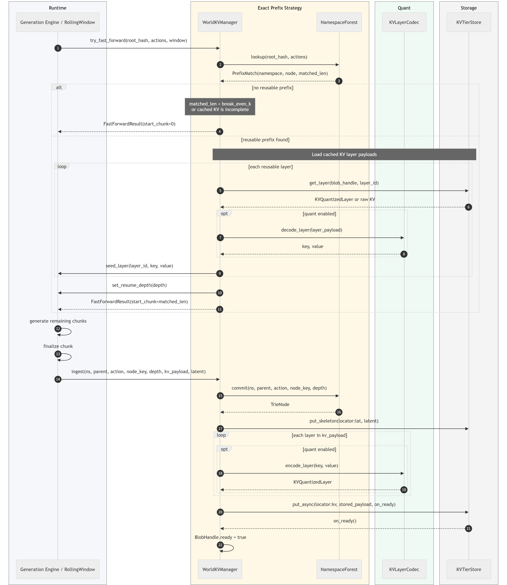
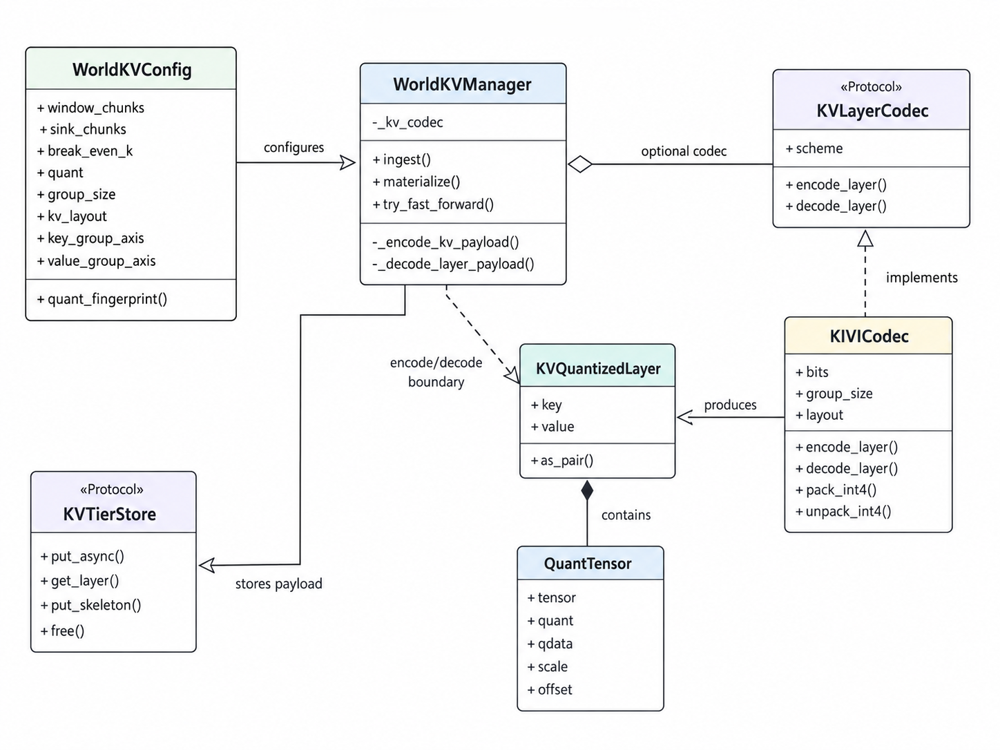
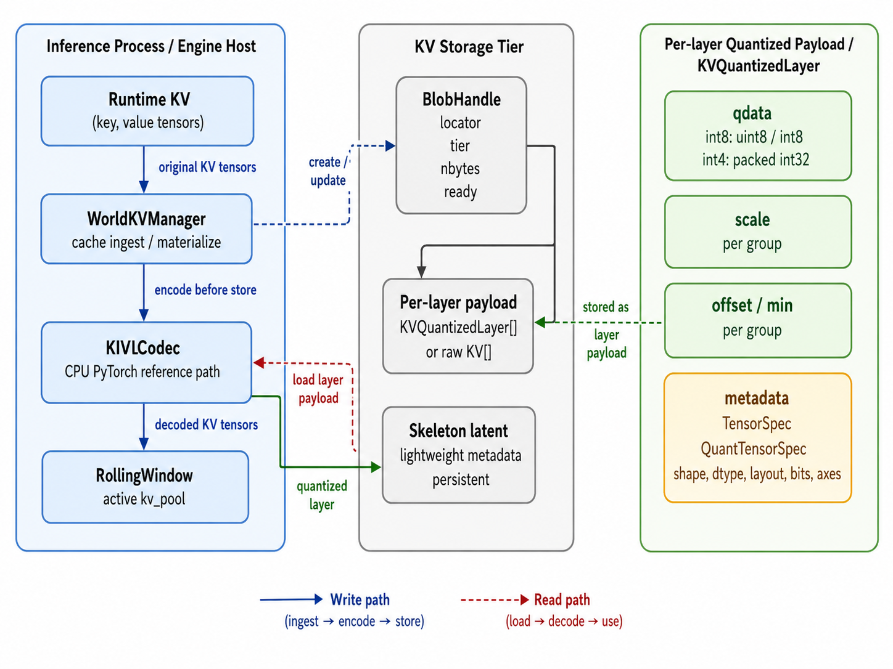
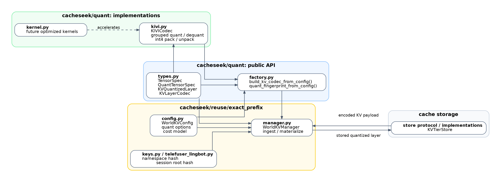
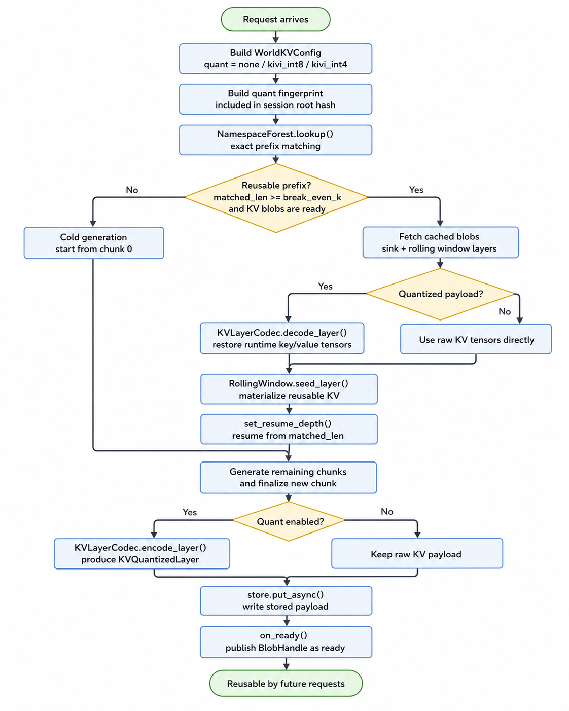

# KV Cache Quantization Design for CacheSeek

CacheSeek provides KV cache reuse strategies such as exact prefix reuse and approximate reuse. As the cached context grows, storing KV cache in raw precision can introduce significant memory and storage overhead. This becomes more important in long-context, multi-session, or multi-chunk generation scenarios.

To address this, we introduce a reusable KV cache quantization component under `cacheseek/quant`. The quantization component is designed as a common capability, and each reuse strategy can decide whether to enable it through its own configuration.

## Quantization Methods

CacheSeek supports 3 quantization methods:

| Method | Description | Use Case |
|--------|-------------|----------|
| `none` | The KV cache is stored in its original precision without any quantization. | When memory and storage overhead are not a concern, or when the highest precision is required. |
| `kivi-int8` | The KV cache is quantized to 8 bits using the KIVI quantization method. | When memory and storage overhead is a concern, and a balance between precision and efficiency is desired. |
| `kivi-int4` | The KV cache is quantized to 4 bits using the KIVI quantization method. | When memory and storage overhead is very high, and a lower precision is acceptable. |

Below is a summary of the supported quantization methods for each reuse strategy, along with their default settings:

| Strategy | Supported Quantization Methods | Default |
|----------|----------------------------------|---------|
| Exact Prefix Reuse | `none`, `kivi-int8`, `kivi-int4` | `none` |
| Approximate Reuse | `none`| `none` |

### KIVI Quantization

KIVI quantization is a common quantization method, CacheSeek provides two variants: `kivi-int8` and `kivi-int4`.

#### How KIVI Quantization Works

KIVI stores each key/value tensor as small integer data plus per-group metadata.
For a group of floating-point values `x`, CacheSeek uses asymmetric min-offset
quantization:

```text
levels = 2^bits - 1
offset = min(x)
scale = (max(x) - offset) / levels
q = clamp(round((x - offset) / scale), 0, levels)
x' = q * scale + offset
```

If all values in a group are equal, the stored scale is `0` and decoding returns
the shared `offset` value. For `kivi-int8`, `q` is stored as `uint8`. For
`kivi-int4`, eight 4-bit values are packed into `uint32`. 

For example, with `bits=4`, a group whose values range from `-1.0` to `2.0`
uses `levels=15`, `offset=-1.0`, and `scale=0.2`. A value of `0.6` is stored as
`round((0.6 - (-1.0)) / 0.2) = 8` and decoded back to `8 * 0.2 - 1.0 = 0.6`.

#### Key Parameters

| Parameter | Type | Description | Default |
|-----------|------|-------------|---------|
| `bits` | int | The number of bits to quantize the KV cache to. | 8 for `kivi-int8`, 4 for `kivi-int4` |
| `group_size` | int | The size of the group for quantization. | 64 |
| `layout` | str | The layout of the input KV cache | `H,T,D` |
| `value_group_axis` | str/int | The axis along which the values are grouped for quantization. | `D` |
| `key_group_axis` | str/int | The axis along which the keys are grouped for quantization. | `T` |
| `scale_dtype` | str | The data type for the scale values used in quantization. | `float32` |
| `offset_dtype` | str | The data type for the offset values used in quantization. | `float32` |

Detailed implementation of KIVI quantization can be found in the `cacheseek/quant/kivi.py` file.

## How to Integrate Quantization into a Reuse Strategy

Quantization is integrated at the reuse-strategy boundary, not in the model
runtime and not in the generic KV store. A strategy decides whether a codec is
enabled from its own config, writes quantized payloads when a chunk is committed,
and decodes them only when a cache hit is materialized back into the active KV
window.


### Example: Integrating KIVI into Exact-Prefix Reuse

Using `cacheseek/reuse/exact_prefix/` as the reference implementation:

1. Add quantization fields to the strategy config.

   `WorldKVConfig` carries the codec-facing knobs:

   ```python
   quant: str = "none"
   group_size: int = 64
   kv_layout: str = "H,T,D"
   key_group_axis: str | int = "T"
   value_group_axis: str | int = "D"
   scale_dtype: str = "float32"
   offset_dtype: str = "float32"
   ```

   The same fields are exposed through `quant_fingerprint()`. Include this
   fingerprint in the namespace/root hash so caches written with different
   quantization settings cannot be reused together.

2. Initialize one codec when the strategy manager is constructed.

   `WorldKVManager.__init__` calls:

   ```python
   self._kv_codec = build_kv_codec_from_config(cfg)
   ```

   The factory returns `None` for `quant="none"` and a `KIVICodec` for
   `kivi-int8` or `kivi-int4`. Build the codec once per manager/config, then
   reuse it for every chunk. Do not rebuild it per layer or per lookup.

3. Encode before committing a finalized chunk.

   On the exact-prefix write path, `ingest()` receives `kv_payload` as a
   sequence of per-layer `(key, value)` pairs. Before creating the `BlobHandle`
   and calling `store.put_async`, the manager runs:

   ```python
   stored_payload = self._encode_kv_payload(kv_payload)
   ```

   `_encode_kv_payload()` leaves the payload unchanged when `_kv_codec is None`.
   Otherwise it calls `encode_layer(key, value)` for each layer and stores a
   `KVQuantizedLayer` containing quantized key/value tensors plus scale and
   offset metadata. The chunk commit then writes that encoded payload through
   the tier store. The tier store remains opaque: it stores the returned Python
   objects and does not need quantization-specific branching.

4. Account for the stored representation.

   Size accounting should measure the post-quantization payload, not the
   original runtime tensors. Exact-prefix reuse uses `_stored_payload_nbytes()`
   to walk the stored payload and sum `qdata`, `scale`, and `offset` tensors for
   each `KVQuantizedLayer`. This keeps eviction and tiering decisions aligned
   with the actual cache footprint.

5. Decode while materializing a cache hit.

   On a hit, `materialize()` walks the matched prefix path, fetches one stored
   layer payload from every chunk, and converts it back to runtime KV form:

   ```python
   payload = self.store.get_layer(n.blob, layer)
   runtime_kv = self._decode_layer_payload(payload)
   ```

   `_decode_layer_payload()` returns raw payloads directly when quantization is
   disabled. When a codec is enabled, it requires the stored object to be a
   `KVQuantizedLayer` and calls `decode_layer(payload)` to reconstruct the
   runtime `(key, value)` tensors. The decoded tensors are passed to
   `window.seed_layer(...)`, so the runtime window receives the same logical KV
   shape regardless of how the cache was stored.

#### Illustration

<details>
<summary><i>Process View</i></summary>



</details>

<details>
<summary><i>Logic View</i></summary>



</details>

<details>
<summary><i>Physical View</i></summary>



</details>

<details>
<summary><i>Development View </i></summary>



</details>

<details>
<summary><i>Scenario View </i></summary>

The scenario view describes the end-to-end request flow with exact prefix reuse and optional KV quantization.



</details>


### New Reuse Strategies

For a new reuse strategy, keep the same boundary:

- Put quantization options in the strategy config.
- Add the quantization fingerprint to any cache namespace or compatibility hash.
- Build the codec once from config.
- Encode exactly once on the write path, immediately before storage.
- Decode exactly once on the read path, immediately before seeding runtime KV.
- Keep storage backends unaware of quantization internals unless a backend adds a
  specialized tensor transport optimization.

## Performance Considerations

Tests/Experiments wait to be added here.

## References

- The KIVI quantization method is described in the paper "KIVI: A Tuning-Free Asymmetric 2bit Quantization for KV Cache" (https://arxiv.org/abs/2402.02750).
